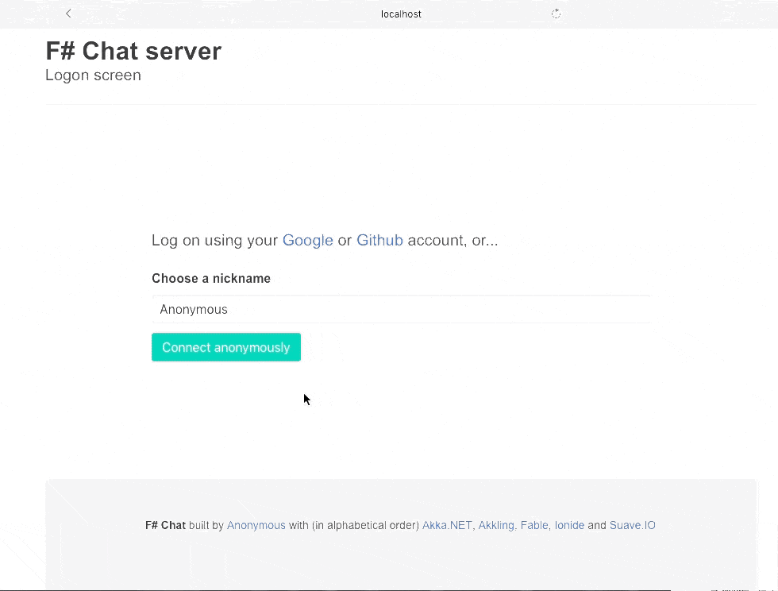
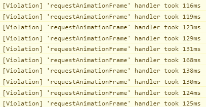
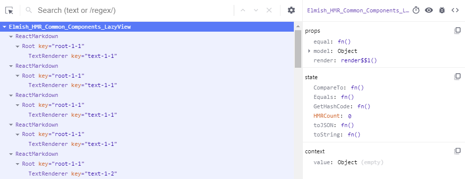
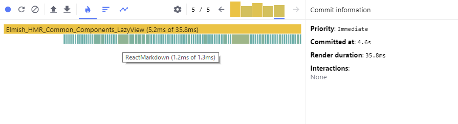
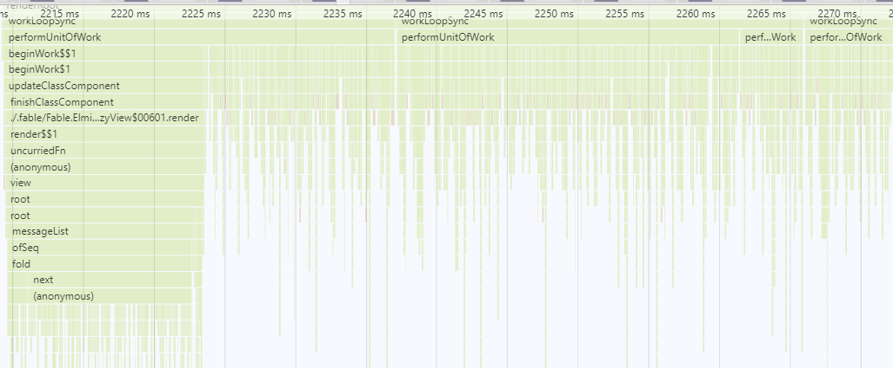

# SAFE-Chat optimization workshop



## Requirements

To build the project (From the original readme)

* [dotnet SDK](https://www.microsoft.com/net/download/core) 2.0.0 or higher
* [.NET Framework 4.6.1 Developer Pack](https://www.microsoft.com/en-us/download/details.aspx?id=49978) to run e2e tests
* [node.js](https://nodejs.org) 4.8.2 or higher
* yarn (`npm i yarn -g`)

To run the workshop:
* Chrome or Firefox (recent version)
* The React Dev Tools extension installed ([For Chrome](https://chrome.google.com/webstore/detail/react-developer-tools/fmkadmapgofadopljbjfkapdkoienihi?hl=en), [For Firefox](https://addons.mozilla.org/en-US/firefox/addon/react-devtools/))

## Building and running the app

Clone the [SAFE-Chat-workshop](https://github.com/vbfox/SAFE-Chat-workshop) repository (⚠ Not the original one ⚠)

Run `fake build` once to get everything setup.

Once done the easiest is to run in 2 terminals (Split the VSCode terminal for example) the following commands:
* ```
  cd src/Server
  dotnet watch run
  ```
* ```
  cs src/Client
  yarn start
  ```

The URL is http://127.0.0.1:8080 and you can use anonymous login.

To clear the server database (normally not needed): remove `src/Server/CHAT_DATA`.

## Documentation to read / watch / refer to

* React [Optimizing Performance](https://reactjs.org/docs/optimizing-performance.html#profiling-components-with-the-chrome-performance-tab) Guide
* React [Reconciliation](https://reactjs.org/docs/reconciliation.html) Guide
* We'll also introduce the [state](https://reactjs.org/docs/hooks-state.html) and [effect](https://reactjs.org/docs/hooks-effect.html) hooks
* [My PR to optimize the SAFE-BookStore sample](https://github.com/SAFE-Stack/SAFE-BookStore/pull/393)
* My Fable:React blogs ([Part 1](https://blog.vbfox.net/2018/02/06/fable-react-1-react-in-fable-land.html) and [Part 2](https://blog.vbfox.net/2018/02/08/fable-react-2-optimizing-react.html))
* My [Fable Conf 2018 Talk](https://www.youtube.com/watch?v=9VJoaNoutm4)

## The Workshop

If you join the **Demo** channel you'll notice that we have a SPAM problem,
someone is sending over and over the text of some obscure sketch.

Nicely they don't post too often but as they nicely say when you join (potentially drowned in the SPAM) you can change that :

> Welcome aboard, user speed is Slow say #slow #medium #fast or #viking to set my speed!

Let's open the browser console (`F12`), say `#viking` and see what happens... After a few seconds:



Your browser will also start to be slow on this tab up to the point of not being able to scroll or do anything. Close the tab, create a new one and type `#slow` after joining the channel.

Your mission is simple: Handle `#viking` mode without browser slow down 👍

## Step 1: Exploring the measurement tools

Ok let's learn the React Dev Tools, open the Components one and you'll see a window like that :



This is the tree of elements that react know about, and as you can see Elmish generate one and the external ReactMarkDown component too, but SAFE-Chat doesn't have any.

The consequence is that each new message re-render the whole page, to prove that's what happen open the React Profiler and record a trace with a few updates



Each message make all the previous messages, the menu and the rest of the page re-render.

The same thing can also be seen by using the browser embedded performance measurement tool (Notice that React send Timing information about what component is rendering)



### Tasks

1. Explore the react Component tree
2. Use the react profiler in the Demo channel with at least a few messages
3. Use the browser performance measurement tool and explore both the timing information posted by react and the flamegraph of javascript method calls.

## Step 2: Introducing components

The menu in `src/Client/NavMenu/View.fs` is the first thing we'll refactor.

The most simple component can be `menuItemChannel`, the function can be replaced by a function-component:

```Fsharp
type private MenuItemChannelProps = {
  ch: ChannelInfo
  currentPage: Route
}

let private menuItemChannel = elmishView "ChannelMenuItem" ByValue <| fun { ch = ch; currentPage = currentPage } ->
    let targetRoute = Channel ch.Id
    let jump _ = document.location.hash <- toHash targetRoute
    menuItem (OnClick jump) ch.Name ch.Topic (targetRoute = currentPage)
```

That can be used like that:

```fsharp
menuItemChannel { ch = ch.Info; currentPage = currentPage }
```

### Tasks

1. Replace the parts of the menu with components to have a nice tree with `Menu` > `AllChannels` > `Channels`, a component for the user block, ...<br/>
   To help you, the props for `menu` are :
   ```fsharp
   type MenuProps = {
       chatData: Model
       currentPage: Route
       dispatch: ChatServer.Types.Msg -> unit
   }
   ```
2. Use `ofList` or `ofArray` functions with each element having a distinct `key: string` prop in all channels and user channels.

## Step 3: The menu shouldn't re-render

If you check the React Profiler, it's still re-rendering the menu


3. Measure the result with the profiler and notice that the joined channel list still update for each render.
4. Search for the culprit (Or read the next line)
5. The source is the messages themselves, but we actually don't need the full channel information for connected channels, only their `.Info` field. Change the props to reflect that.
6. Measure again and check that the menu doesn't render anymore on each message
7. You can also play with replacing `ByValue` with `ByRef` for some of the components to see the result.

# Step 3: Rendering the messages with components


## Acknowledgements

This workshop is based on the [SAFE-Chat](https://github.com/SAFE-Stack/SAFE-Chat) sample on commit
`51a2d500253351648e577b6cd2f17ac0c7d7f3ba` thanks to all the contributors for their work.

Also thanks 💕 to everyone working on Fable, Fable React, Ionide and the rest of the F# universe there would be nothing possible without you.