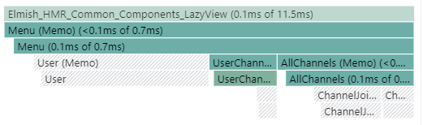
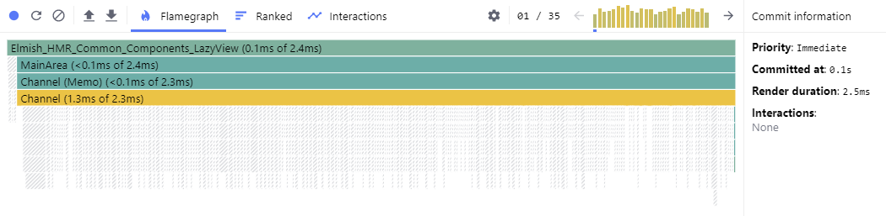

# SAFE-Chat optimization workshop


## Requirements

To build the project (From the original readme)

* [dotnet SDK](https://www.microsoft.com/net/download/core) 2.0.0 or higher
* [.NET Framework 4.6.1 Developer Pack](https://www.microsoft.com/en-us/download/details.aspx?id=49978) to run e2e tests
* [node.js](https://nodejs.org) 4.8.2 or higher
* yarn (`npm i yarn -g`)

To run the workshop:
* Chrome or Firefox (recent version)
* The React Dev Tools extension installed ([For Chrome](https://chrome.google.com/webstore/detail/react-developer-tools/fmkadmapgofadopljbjfkapdkoienihi?hl=en), [For Firefox](https://addons.mozilla.org/en-US/firefox/addon/react-devtools/))

## Building and running the app

Clone the [SAFE-Chat-workshop](https://github.com/vbfox/SAFE-Chat-workshop) repository (⚠ Not the original one ⚠)

Run `fake build` once to get everything setup.

Once done the easiest is to run in 2 terminals (Split the VSCode terminal for example) the following commands:
* ```
  cd src/Server
  dotnet watch run
  ```
* ```
  cs src/Client
  yarn start
  ```

The URL is http://127.0.0.1:8080 and you can use anonymous login.

To clear the server database (normally not needed): remove `src/Server/CHAT_DATA`.

## Documentation to read / watch / refer to

* React [Optimizing Performance](https://reactjs.org/docs/optimizing-performance.html#profiling-components-with-the-chrome-performance-tab) Guide
* React [Reconciliation](https://reactjs.org/docs/reconciliation.html) Guide
* We'll also introduce the [state](https://reactjs.org/docs/hooks-state.html) and [effect](https://reactjs.org/docs/hooks-effect.html) hooks
* [My PR to optimize the SAFE-BookStore sample](https://github.com/SAFE-Stack/SAFE-BookStore/pull/393)
* My Fable:React blogs ([Part 1](https://blog.vbfox.net/2018/02/06/fable-react-1-react-in-fable-land.html) and [Part 2](https://blog.vbfox.net/2018/02/08/fable-react-2-optimizing-react.html))
* My [Fable Conf 2018 Talk](https://www.youtube.com/watch?v=9VJoaNoutm4)

## The Workshop

If you join the **Demo** channel you'll notice that we have a SPAM problem,
someone is sending over and over the text of some obscure sketch.

Nicely they don't post too often but as they nicely say when you join (potentially drowned in the SPAM) you can change that :

> Welcome aboard, user speed is Slow say #slow #medium #fast or #viking to set my speed!

Let's open the browser console (`F12`), say `#viking` and see what happens... After a few seconds:


Your browser will also start to be slow on this tab up to the point of not being able to scroll or do anything. Close the tab, create a new one and type `#slow` after joining the channel.

Your mission is simple: Handle `#viking` mode without browser slow down 👍

## Step 1: Exploring the measurement tools

Ok let's learn the React Dev Tools, open the Components one and you'll see a window like that :


This is the tree of elements that react know about, and as you can see Elmish generate one and the external ReactMarkDown component too, but SAFE-Chat doesn't have any.

The consequence is that each new message re-render the whole page, to prove that's what happen open the React Profiler and record a trace with a few updates


Each message make all the previous messages, the menu and the rest of the page re-render.

The same thing can also be seen by using the browser embedded performance measurement tool (Notice that React send Timing information about what component is rendering)


### Tasks

1. Explore the react Component tree
2. Use the react profiler in the Demo channel with at least a few messages
3. Use the browser performance measurement tool and explore both the timing information posted by react and the flamegraph of javascript method calls.

## Step 2: Introducing components

The menu in `src/Client/NavMenu/View.fs` is the first thing we'll refactor by introducing components, it's not the part that slow down the page the most but it's very static and should never be updated between renders when the user doesn't interact with it.

The most simple component can be `menuItemChannel`, the function can be replaced by a function-component:

```Fsharp
type private MenuItemChannelProps = {
  ch: ChannelInfo
  currentPage: Route
}

let private menuItemChannel = elmishView "ChannelMenuItem" ByValue <| fun { ch = ch; currentPage = currentPage } ->
    let targetRoute = Channel ch.Id
    let jump _ = document.location.hash <- toHash targetRoute
    menuItem (OnClick jump) ch.Name ch.Topic (targetRoute = currentPage)
```

That can be used like that:

```fsharp
menuItemChannel { ch = ch.Info; currentPage = currentPage }
```

### Tasks

1. Start with replacing `menuItemChannel` and looking at the differences in the React Dev Tools
2. Replace the div with `fs-user` class with a component
3. Replace the root and mainArea functions in `App/View.fs` with components
4. Now that you have the trick do it for a more complex tree and replace the parts of the menu with components to have a nice tree with `Menu` > `AllChannels` > `Channels` as a hierarchy<br/>
   To help you, the props for `menu` are :
   ```fsharp
   type MenuProps = {
       chatData: Model
       currentPage: Route
       dispatch: ChatServer.Types.Msg -> unit
   }
   ```
5. Use `ofList` or `ofArray` functions with each element having a distinct `key: string` prop in "all channels" and "user channels".

## Step 3: The menu shouldn't re-render

*You can fast-forward here by doing `git checkout workshop-step-2` or by looking at what you're missing in the [workshop-step-2](https://github.com/vbfox/SAFE-Chat-workshop/tree/workshop-step-2) branch*

If you check the React Profiler, it's still re-rendering the menu, something is still changing in the props!



### Tasks

1. Profile on your solution and check that it still render.
4. Search for the culprit (Or read the next line)
5. The source is the messages themselves, but we actually don't need the full channel information for connected channels, only their `.Info` field. Change the props to reflect that, transforming the full model to a menu-oriented one.
6. Measure again and check that the menu doesn't render anymore on each message
7. You can also play with replacing `ByValue` with `ByRef` for some of the components to see the result.

## Step 4: Rendering the messages with components

*You can fast-forward here by doing `git checkout workshop-step-3` or by looking at what you're missing in the [workshop-step-3](https://github.com/vbfox/SAFE-Chat-workshop/tree/workshop-step-3) branch*

It's now time to apply all of that to the messages themselves !

### Task

A single one, convert `src/Client/Channel/View.fs` up to the point where the `#viking` mode is fast enough to be usable.

The react profiler should look something like this :



Remarks:

* You might have to limit the number of messages displayed if you want to keep performances in the long run. Without doing anything more, limiting to `1000` messages should give you very good performance if only one message really render in the DOM each time.
* The times won't update correctly but you can ignore that as we'll tackle it in the next step.
* If you navigate between channels you'll notice React errors in the console and weird things happening, let's find why and solve them.

## Step 5: Rendering the dates with useEffect and useState

Now let's use [`useState`](https://reactjs.org/docs/hooks-state.html) and [`useEffect`](https://reactjs.org/docs/hooks-effect.html) react [hooks](https://reactjs.org/docs/hooks-intro.html) to solve our relative time display problem.

Displaying relative times is a purely UI problem that has nothing to do with our model, and can use local state inside a component instead of relying on the elmish update model.

Hooks are a way to achieve that inside a functional react component and might completely replace the react class syntax in the long term.

Here is a small example :
```fsharp
let private mkDisposable (f : unit -> unit): System.IDisposable =
    { new System.IDisposable with member __.Dispose() = f() }

let private useSlowCounter () =
    let counterState = Hooks.useState<int> 0
    Hooks.useEffectDisposable(fun () ->
        let timeoutId = Browser.Dom.window.setInterval((fun () ->
            counterState.update(counterState.current + 1)), 5000)
        mkDisposable (fun () ->
            Browser.Dom.window.clearInterval timeoutId))
    counterState.current

let slowCounter = elmishView "SlowCounter" ByRef <| fun () ->
    let counter = useSlowCounter ()
    span [Style [Color "red"; BackgroundColor "yellow"]] [ofInt counter]
```

### Task

Replace the time display that is currently buggy (because we never update the DOM as the date doesn't change) with a component displaying relative time using hooks

## Step 6: Let's remove a few function creations

*You can fast-forward here by doing `git checkout workshop-step-2` or by looking at what you're missing in the [workshop-step-4](https://github.com/vbfox/SAFE-Chat-workshop/tree/workshop-step-4) branch*

While it won't change our performance much here, let's remove the allocations generated each render when we generate the wrapped dispatch as it's a frequent source of allocations. The same method can also be reused in a lot more cases so it's generally useful.

Code that wrap dispatch like that line in `src\Client\App\View.fs` :

```fsharp
dispatch = (ApplicationMsg >> ChatDataMsg >> dispatch)
```

will allocate 2 functions each time the application is rendered. But in Elmish dispatch always does the same thing, it doesn't functionally change between renders so we can actually cache the result and always reuse it. We could do it manually but let's use [`memoize-once`](https://www.npmjs.com/package/memoize-one) as it's a lot more useful.

It memoize the result of a function for the latest arguments that were passed to it.

A very useful usage is to generate what would be a ViewModel in MVVM, values computed directly from part of the model that only change when the model changes.

### Task

* `dispatch` isn't actually stable in our application (The object reference is different each render) because `toNavigableWith` in `Elmish.Navigation` has the same problem we have here it re-wrap it every time, so let's use a mutable variable to capture it once and reuse it. Optionally you can also PR the library 😉
* `memoizeOnce` is already wrapped in the modified sample, and the javascript library imported, so use it on the various cases where dispatch is wrapped

### Remark

As soon as you use it on a function taking more than one argument you'll see that it doesn't work due to the way fable compile and invoke functions. The easiest way to fix his is to use only tupled functions and this little helper that replace memoizeOnce comparison function:

```fsharp
[<ImportDefault("memoize-one")>]
let memoizeOnceWithEquality<'t>(value: 't, equaliyFn: obj[] -> obj[] -> bool): 't = jsNative

[<Emit("Array.isArray($0)")>]
let private isArray (x: obj) = jsNative

let inline private shallowArrayEquals (a: obj[]) (b: obj[]) =
    if a.Length <> b.Length then
        false
    else
        let mutable i = 0
        let mutable equals = true
        while i < a.Length && equals do
            let valueA = a.[i]
            let valueB = b.[i]
            equals <- System.Object.ReferenceEquals(valueA, valueB)
            i <- i + 1
        equals

let private tupledShallowArrayEquals (a: obj[]) (b: obj[]) =
    if a.Length = 1 && b.Length = 1 && isArray a.[0] && isArray b.[0] then
        shallowArrayEquals (unbox a.[0]) (unbox b.[0])
    else
        JS.console.error("tupledShallowArrayEquals called with non tupled arguments: ", a, b)
        failwithf "tupledShallowArrayEquals called with non tupled arguments: %A, %A" a b

let memoizeOnceTupled<'t>(value: 't): 't = memoizeOnceWithEquality(value, tupledShallowArrayEquals)
```

## Step 7: Virtualize the list

That step is open-ended as I don't think we'll have time to go that far, but as the [Optimizing Performance](https://reactjs.org/docs/optimizing-performance.html#virtualize-long-lists) react documentation evoke, for very big lists virtualizing them (And ideally lazy-loading missing elements from the server) is a key optimization.

react virtualized with CellMeasurer to handle dynamic height text and AutoSizer to size it would be a good start.

## Acknowledgements

This workshop is based on the [SAFE-Chat](https://github.com/SAFE-Stack/SAFE-Chat) sample on commit
`51a2d500253351648e577b6cd2f17ac0c7d7f3ba` thanks to all the contributors for their work.

Also thanks 💕 to everyone working on Fable, Fable React, Ionide and the rest of the F# universe there would be nothing possible without you.